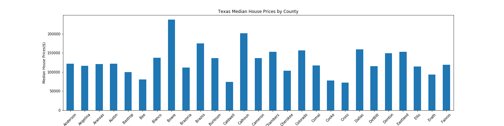
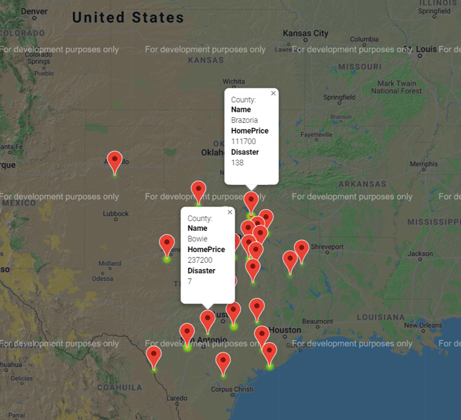
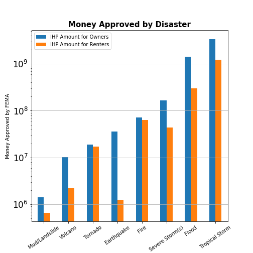
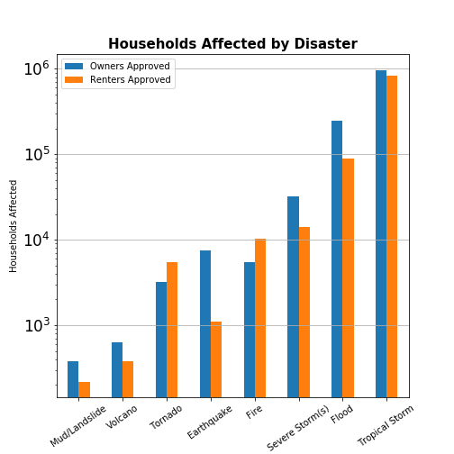
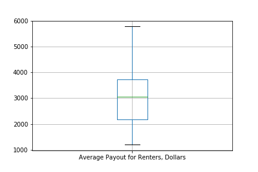
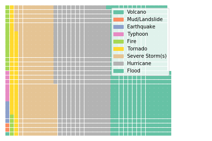
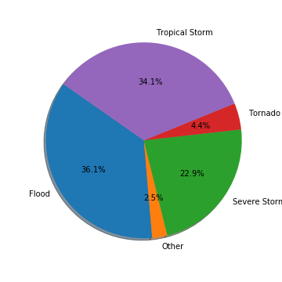
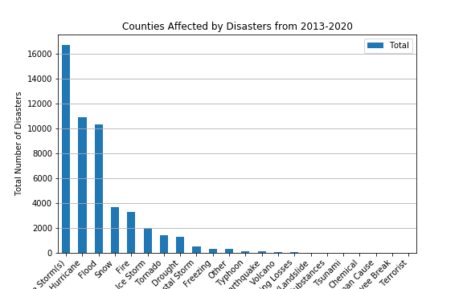

# FEMA_Analytics

This project was created by 4 team members to analyse and co-relate data from Federal Emergency Management Agency(FEMA) and Median House Prices from Zillow. 

Team 5 Project Plan:
1. Data Set: 
    a. FEMA - https://www.fema.gov/openfema-dataset-openfema-data-sets-v1
    b. Zillow API: http://www.zillow.com/webservice/GetRegionChildren

2. Exploratory Analysis:
    ### FEMA Disaster regions
    ### FEMA Cost per disaster
    ### FEMA Budget per disaster
    ### FEMA After-effects of disaster
    ### Zillow House Prices By County

3. Analysis Results:
For Analysis purpose, FEMA and Zillow data was compared between the state of Texas. As per the comparision, it was found that few counties did show direct corelation between the number of disasters and house prices. However, the pattern was not consistent which indicates there were other factors affecting the house prices. 
## Texas Disaster by County

## Texas Median House by County

## MAP

## Comparing Payouts by Disaster
  

## Boxplot of Average Payout by State

## Other Charts of Disasters

Folders:
1. Final_Data - contains the data files to be used for analysis
2. Archive - contains redundant files
3. Final Presentation - contains .ppt presentation of the project
4. Output_Visual - contains out put of all visuals created.

Git Commands to Push Changes:
1. git add -A 
2. git commit -m "COMMENT WHAT CHANGES INCLUDED"
3. git push

Additional GIT Commands:
1. git pull origin master                   #pulls changed files from master
2. git checkout -t origin/branch-name       #switch to a new branch
3. git push origin branch-name              #push changes to the branch
